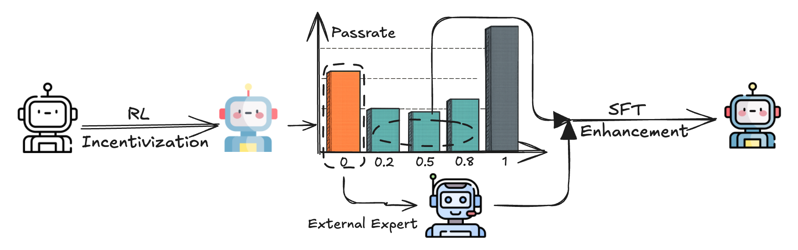

<h1 align="center">Metis-RISE: RL Incentivizes and SFT Enhance Multimodal Reasoning Model Learning</h1>

<h5 align="center">

[](https://arxiv.org/abs/2506.13056)&ensp;<a href='https://huggingface.co/collections/mmthinking/metis-rise-685cac221b6a0d9571db7f8b'></a>&ensp;[](https://github.com/tatsu-lab/stanford_alpaca/blob/main/LICENSE)

</h5>


## 💡 Overview

We introduces **Metis-RISE** (**R**L **I**ncentivizes and **S**FT **E**nhances), a hybrid training paradigm that strategically sequences RL and SFT to significantly advance multimodal reasoning in MLLMs. By prioritizing RL-driven exploration, Metis-RISE incentivizes the model to unlock latent reasoning skills and avoids premature convergence often seen in SFT-first approaches. Subsequently, targeted SFT stages enhance these capabilities by efficiently addressing inconsistent reasoning through self-distilled trajectories and rectifying fundamental capability absence via expert knowledge injection. Metis-RISE-72B scores an average of 56.6 on the [OpenCompass Multimodal Reasoning Leaderboard](https://rank.opencompass.org.cn/leaderboard-multimodal-reasoning/?m=REALTIME), ranking tied for **fourth** on the overall leaderboard (as of June 26, 2025).



## 📢 News
- **[2025-06-23]** 🚀 Both Metis-RISE 7B and 72B model checkpoints are now available on [🤗 HuggingFace](https://huggingface.co/collections/mmthinking/metis-rise-685cac221b6a0d9571db7f8b)! 
- **[2025-06-16]** 🎉 We release the technical report of Metis-RISE on [Arxiv](https://arxiv.org/abs/2506.13056)! 


## 📊 Results
We evaluate both **Metis-RISE-7B** and **Metis-RISE-72B** on the comprehensive [OpenCompass Multimodal Reasoning Leaderboard](https://rank.opencompass.org.cn/leaderboard-multimodal-reasoning/?m=REALTIME). Both of them achieve state-of-the-art performance among similar-sized models, with the 72B version ranking fourth overall on the full leaderboard (as of June 26, 2025), validating the effectiveness and scalability of the Metis-RISE framework for enhancing multimodal reasoning.

<table>
<thead>
<tr>
<th align="left"><strong>Model</strong></th>
<th align="center"><strong>Avg.</strong></th>
<th align="center"><strong>MathVista</strong></th>
<th align="center"><strong>MathVision</strong></th>
<th align="center"><strong>MathVerse</strong></th>
<th align="center"><strong>DynaMath</strong></th>
<th align="center"><strong>WeMath</strong></th>
<th align="center"><strong>LogicVista</strong></th>
</tr>
</thead>
<tbody>
<tr style="background-color: #f0f0f0;">
<td colspan="8" align="center"><strong><em>Proprietary Models</em></strong></td>
</tr>
<tr>
<td>Seed1.5-VL</td>
<td align="center">73.3</td>
<td align="center">86.8</td>
<td align="center">67.3</td>
<td align="center">79.3</td>
<td align="center">56.1</td>
<td align="center">77.5</td>
<td align="center">72.7</td>
</tr>

<tr>
<td>Gemini-2.5-Pro</td>
<td align="center">72.5</td>
<td align="center">80.9</td>
<td align="center">69.1</td>
<td align="center">76.9</td>
<td align="center">56.3</td>
<td align="center">78.0</td>
<td align="center">73.8</td>
</tr>

<tr>
<td>Doubao-1.5-Pro</td>
<td align="center">61.6</td>
<td align="center">78.6</td>
<td align="center">51.5</td>
<td align="center">64.7</td>
<td align="center">44.9</td>
<td align="center">65.7</td>
<td align="center">64.2</td>
</tr>
<tr>
<td>Gemini-2.0-Pro</td>
<td align="center">56.6</td>
<td align="center">71.3</td>
<td align="center">48.1</td>
<td align="center">67.3</td>
<td align="center">43.3</td>
<td align="center">56.5</td>
<td align="center">53.2</td>
</tr>
<tr>
<td>ChatGPT-4o-202504</td>
<td align="center">54.8</td>
<td align="center">71.6</td>
<td align="center">43.8</td>
<td align="center">49.9</td>
<td align="center">48.5</td>
<td align="center">50.6</td>
<td align="center">64.4</td>
</tr>
<tr>
<td>Gemini-2.0-Flash</td>
<td align="center">50.6</td>
<td align="center">70.4</td>
<td align="center">43.6</td>
<td align="center">47.8</td>
<td align="center">42.1</td>
<td align="center">47.4</td>
<td align="center">52.3</td>
</tr>
<tr>
<td>Claude 3.7 Sonnet</td>
<td align="center">50.4</td>
<td align="center">66.8</td>
<td align="center">41.9</td>
<td align="center">46.7</td>
<td align="center">39.7</td>
<td align="center">49.3</td>
<td align="center">58.2</td>
</tr>
<tr>
<td>GLM-4v-Plus-202501</td>
<td align="center">49.2</td>
<td align="center">73.5</td>
<td align="center">51.1</td>
<td align="center">40.7</td>
<td align="center">27.5</td>
<td align="center">47.7</td>
<td align="center">54.4</td>
</tr>
<tr style="background-color: #f0f0f0;">
<td colspan="8" align="center"><strong><em>Open-source ≤10B Models</em></strong></td>
</tr>
<tr>
<td>Kimi-VL-A3B-Instruct</td>
<td align="center">35.8</td>
<td align="center">66.0</td>
<td align="center">21.8</td>
<td align="center">34.1</td>
<td align="center">18.0</td>
<td align="center">32.3</td>
<td align="center">42.7</td>
</tr>
<tr>
<td>Qwen2.5-VL-7B</td>
<td align="center">40.1</td>
<td align="center">68.1</td>
<td align="center">25.4</td>
<td align="center">41.1</td>
<td align="center">21.8</td>
<td align="center">36.2</td>
<td align="center">47.9</td>
</tr>
<tr>
<td>InternVL3-8B</td>
<td align="center">41.4</td>
<td align="center">70.5</td>
<td align="center">30.0</td>
<td align="center">38.5</td>
<td align="center">25.7</td>
<td align="center">39.5</td>
<td align="center">44.5</td>
</tr>
<tr>
<td>VLAA-Thinker-7B</td>
<td align="center">42.5</td>
<td align="center">68.0</td>
<td align="center">26.4</td>
<td align="center">48.2</td>
<td align="center">22.4</td>
<td align="center">41.5</td>
<td align="center">48.5</td>
</tr>
<tr style="background-color: #e6f3ff;">
<td><strong>Metis-RISE-7B</strong></td>
<td align="center"><strong>46.4</strong></td>
<td align="center"><strong>75.8</strong></td>
<td align="center"><strong>28.7</strong></td>
<td align="center"><strong>51.0</strong></td>
<td align="center"><strong>27.7</strong></td>
<td align="center"><strong>45.2</strong></td>
<td align="center"><strong>49.7</strong></td>
</tr>
<tr style="background-color: #f0f0f0;">
<td colspan="8" align="center"><strong><em>Open-source >10B Models</em></strong></td>
</tr>
<tr>
<td>InternVL3-14B</td>
<td align="center">46.0</td>
<td align="center">74.4</td>
<td align="center">34.0</td>
<td align="center">43.7</td>
<td align="center">30.3</td>
<td align="center">41.3</td>
<td align="center">52.1</td>
</tr>
<tr>
<td>Ovis2-34B</td>
<td align="center">47.9</td>
<td align="center">76.1</td>
<td align="center">31.9</td>
<td align="center">50.1</td>
<td align="center">27.5</td>
<td align="center">51.9</td>
<td align="center">49.9</td>
</tr>
<tr>
<td>QVQ-72B-Preview</td>
<td align="center">46.9</td>
<td align="center">70.3</td>
<td align="center">34.9</td>
<td align="center">48.2</td>
<td align="center">30.7</td>
<td align="center">39.0</td>
<td align="center">58.2</td>
</tr>
<tr>
<td>LLaVA-OneVision-72B</td>
<td align="center">34.7</td>
<td align="center">67.1</td>
<td align="center">25.3</td>
<td align="center">27.2</td>
<td align="center">15.6</td>
<td align="center">32</td>
<td align="center">40.9</td>
</tr>
<tr>
<td>Qwen2.5-VL-72B</td>
<td align="center">50.3</td>
<td align="center">74.2</td>
<td align="center">39.3</td>
<td align="center">47.3</td>
<td align="center">35.9</td>
<td align="center">49.1</td>
<td align="center">55.7</td>
</tr>
<tr>
<td>InternVL3-78B</td>
<td align="center">51.0</td>
<td align="center">79.0</td>
<td align="center">38.8</td>
<td align="center">51.0</td>
<td align="center">35.1</td>
<td align="center">46.1</td>
<td align="center">55.9</td>
</tr>
<tr style="background-color: #e6f3ff;">
<td><strong>Metis-RISE-72B</strong></td>
<td align="center"><strong>56.6</strong></td>
<td align="center"><strong>80.4</strong></td>
<td align="center"><strong>42.7</strong></td>
<td align="center"><strong>59.8</strong></td>
<td align="center"><strong>42.5</strong></td>
<td align="center"><strong>55.1</strong></td>
<td align="center"><strong>58.8</strong></td>
</tr>
</tbody>
</table>

## 🔍 Usage Example

Below is a simple example of how to use Metis-RISE series models for multimodal reasoning tasks:

```python
from transformers import Qwen2_5_VLForConditionalGeneration, AutoProcessor
from qwen_vl_utils import process_vision_info

# Load model (choose between 7B or 72B version)
model_path = 'mmthinking/Metis-RISE-7B' # or mmthinking/Metis-RISE-72B

# Load the model on the available device(s)
model = Qwen2_5_VLForConditionalGeneration.from_pretrained(
    model_path, torch_dtype="auto", device_map="auto"
)

# Best practices to use the following system_prompt and pixel range by default
system_prompt = """Solve the question. The user asks a question, and you solves it. You first thinks about the reasoning process in the mind and then provides the user with the answer. The answer is in latex format and wrapped in $...$. The final answer must be wrapped using the \\boxed{} command. The reasoning process and answer are enclosed within <think> </think> and <answer> </answer> tags, respectively, i.e., <think> Since $1+1=2$, so the answer is $2$. </think><answer> The answer is $\\boxed{2}$ </answer>, which means assistant's output should start with <think> and end with </answer>."""

processor = AutoProcessor.from_pretrained(model_path, min_pixels=128*28*28, max_pixels=16384*28*28)

# Prepare input with image and text
messages = [
    {
        "role": "system",
        "content": system_prompt
    },
    {
        "role": "user",
        "content": [
            {
                "type": "image",
                "image": "assets/example_case.jpg",
            },
            {"type": "text", "text": "If the pattern continues, what would be the Y value when X=11?"},
        ],
    }
]

# Preparation for inference
text = processor.apply_chat_template(
    messages, tokenize=False, add_generation_prompt=True
)
image_inputs, video_inputs = process_vision_info(messages)
inputs = processor(
    text=[text],
    images=image_inputs,
    videos=video_inputs,
    padding=True,
    return_tensors="pt",
)
inputs = inputs.to(model.device)

# Inference: Generation of the output
generated_ids = model.generate(**inputs, max_new_tokens=8192)
generated_ids_trimmed = [
    out_ids[len(in_ids) :] for in_ids, out_ids in zip(inputs.input_ids, generated_ids)
]
output_text = processor.batch_decode(
    generated_ids_trimmed, skip_special_tokens=True, clean_up_tokenization_spaces=False
)
print(output_text[0])
```

## 🤗 Checkpoints

| Model        |Huggingface                                                                              |
| ------------ | ---------------------------------------------------------------------------------------- |
| Metis-RISE-7B   | [mmthinking/Metis-RISE-7B](https://huggingface.co/mmthinking/Metis-RISE-7B)       |
| Metis-RISE-72B   | [mmthinking/Metis-RISE-72B](https://huggingface.co/mmthinking/Metis-RISE-72B)       |


## 📌 Acknowledgement
We sincerely appreciate [LLaMA-Factory](https://github.com/hiyouga/LLaMA-Factory) and [MM-EUREKA](https://github.com/ModalMinds/MM-EUREKA) for providing reference training framework.

## 📖 Citation

```bibtex
@article{qiu2025metis,
  title={Metis-RISE: RL Incentivizes and SFT Enhances Multimodal Reasoning Model Learning},
  author={Qiu, Haibo and Lan, Xiaohan and Liu, Fanfan and Sun, Xiaohu and Ruan, Delian and Shi, Peng and Ma, Lin},
  journal={arXiv preprint arXiv:2506.13056},
  year={2025}
}
```